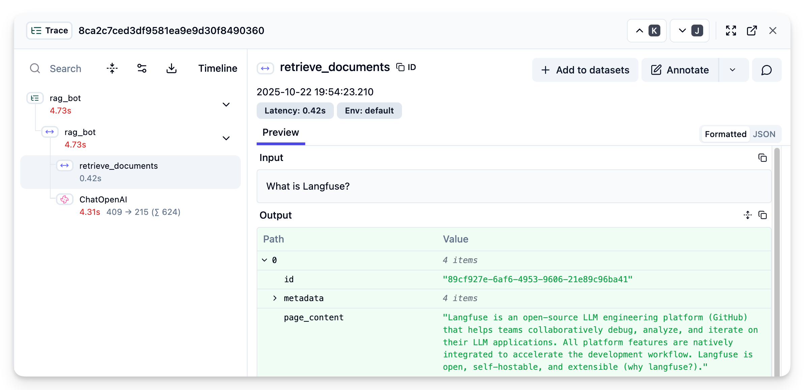
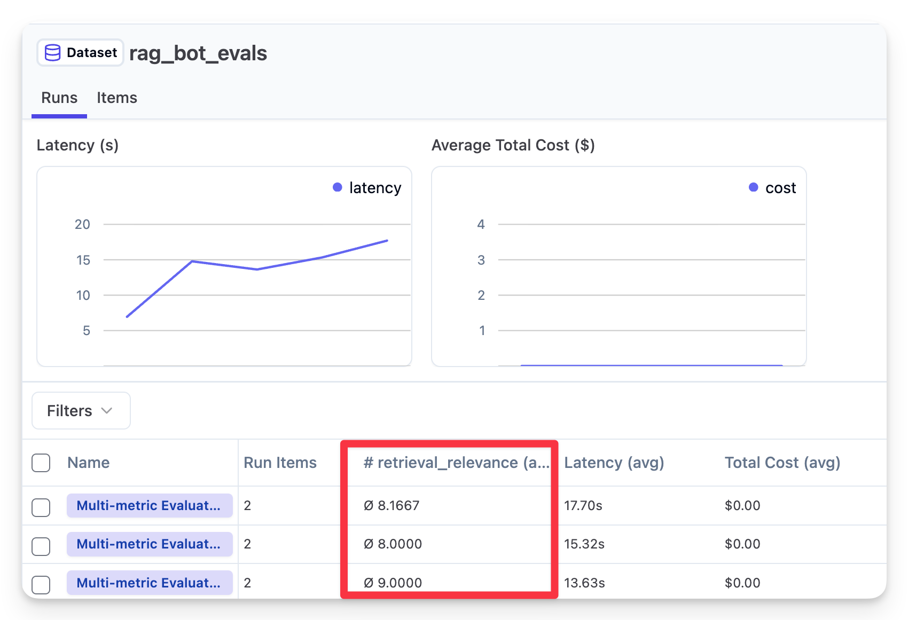

# RAG Obvservability and Evals with Langfuse

A RAG (Retrieval-Augmented Generation) chatbot that answers questions about Langfuse using OpenAI and LangChain, with observability and evals.

## Features

- **Observability**: Full tracing of the RAG pipeline with Langfuse
- **Evaluation**: Custom evaluation of the RAG pipeline with Langfuse Experiments

## Requirements

• Python ≥3.11
• OpenAI API key
• Langfuse credentials

## Setup

Create .env with:

```
OPENAI_API_KEY=your_key
LANGFUSE_PUBLIC_KEY=your_key
LANGFUSE_SECRET_KEY=your_key
LANGFUSE_HOST=https://cloud.langfuse.com
```

```bash
uv sync
```

## Usage

Run the bot:

```
uv run rag_bot/main.py
```

You should see traces in Langfuse like this:



Run evaluations:

Create a dataset in Langfuse with the following name: `rag_bot_evals`

Each item in the dataset should have the following fields:
- input: `{ "question": "What is Langfuse?" }`
- expected_output: `{ "answer": "Langfuse is a platform for building and evaluating LLMs." }`

Then run the evaluation:

```
uv run rag_bot/evaluation.py
```

You should see the evaluation results in Langfuse like this:


